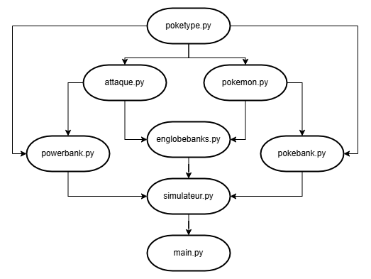

# Simulateur d'efficacité dans Pokemon GO en PvP

## Plan du dossier

Comprenez les liaisons A -> B comme "A est nécessaire pour faire fonctionner B".

## Fichiers

### poketype.py
Y sont définis les 18 types de Pokémon. Ne changez rien.

### attaque.py
Défini la structure de données associée aux attaques. Ne changez rien.

### powerbank.py
Ecrivez-y toutes les attaques que vous souhaitez intégrer au simulateur, selon le modèle des attaques déjà renseignées.

### pokebank.py
Ecrivez-y tous les Pokemon que vous souhaitez intégrer au simulateur, selon le modèle des Pokémons déjà renseignés.

### englobebanks.py
Défini la structure de données associée aux ensembles Pokémon + attaque rapide + attaque chargée. Ne changez rien.

### simulateur.py
Après `self.pokeDonnee=[`, associez les Pokémon et les attaques que vous souhaitez intégrer au simulateur, selon le modèle des enregistrements déjà renseignés. Ne touchez pas au reste.

### main.py  
Le fichier à exécuter. Vous pouvez y modifier la durée de la simulation (par défaut 60 secondes) dans `duree_simulation = 60` et la statistique de défense du Pokémon adverse à `defense_cible = 100`. 

## Qu'est-ce qui est pris en compte ?  
Le simulateur prend en considération :  
- dégâts par seconde des attaques rapides
- énergie par seconde des attaques rapides
- dégâts des attaques chargées
- coût en énergie des attaques chargés
- types des attaques
- type(s) des Pokémon
- nom des Pokémon
- statistiques des Pokémon (ou plutôt leur moyenne)
- stab

Le simulateur ne prend pas en considération :
- météo, car n'existe pas en PvP
- IV, car tous les Pokémon sont testés de façon égalitaire (donc ils ont tous les mêmes IV)
- niveau, pour la même raison
- efficacité des types, car biaise les comparaisons en fonction du type du Pokémon défenseur